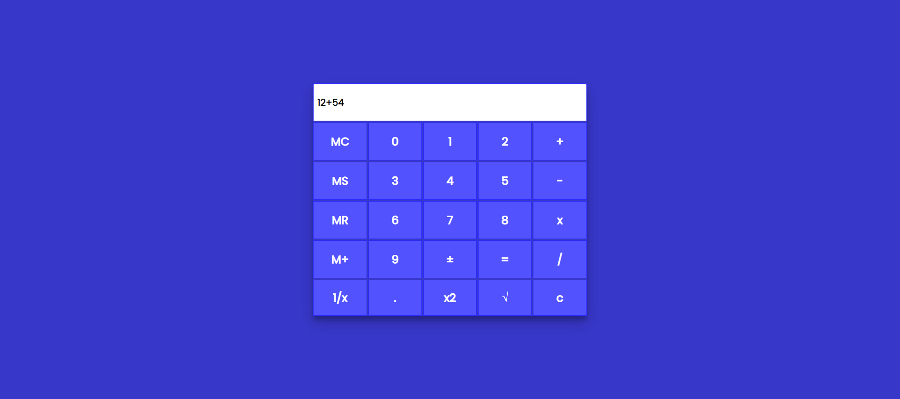

# Calculator

🚀 Full-fledged calculator using JavaScript!

## Functions

- `MS` store value in memory.
- `MR` recall memory.
- `MC` clear stored value from memory.
- `M+` add entered value to the stored value in memory and save it.

